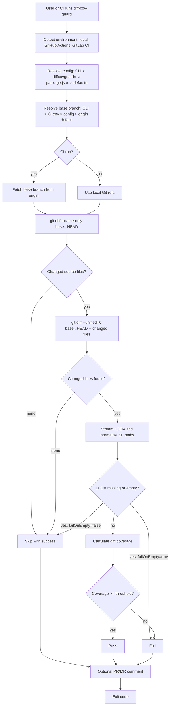
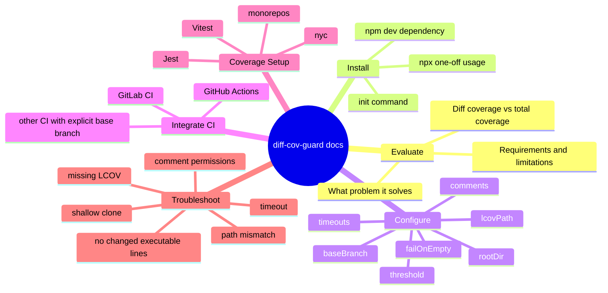

# Docusaurus Documentation Site Plan

This document is the product and information architecture map for a future `diff-cov-guard` documentation site. It is
based on the current README, CLI implementation, schema, and tests. The goal is to turn the project from "a CLI with a
good README" into a documentation experience that helps users understand whether the tool fits their CI setup, how to
install it safely, and how to debug the common edge cases around diff coverage.

## Current System Model

`diff-cov-guard` is an ESM Node.js CLI that enforces coverage only for executable lines changed in the current diff. It
does not run tests and does not generate coverage. It expects an existing LCOV report, discovers the changed files and
changed lines with Git, maps LCOV `SF:` paths back to repository-relative paths, calculates diff coverage, optionally
publishes one stable PR/MR comment, and exits with success or failure.



## What README Already Covers

| Area            | Current coverage                                                                                                          |
| --------------- | ------------------------------------------------------------------------------------------------------------------------- |
| Product promise | Explains that the CLI checks changed JS/TS lines from an existing LCOV report.                                            |
| Preconditions   | Lists Git, Node.js 20+, existing coverage command, default LCOV path, available base branch, supported source extensions. |
| Installation    | Covers `npm install --save-dev` and `npx -y`.                                                                             |
| Basic config    | Shows `.diffcovguardrc`, `rootDir`, `failOnEmpty`, timeouts, and comment limits.                                          |
| Local usage     | Shows `npm run test:cov` before `npx diff-cov-guard`.                                                                     |
| GitHub Actions  | Shows workflow with `fetch-depth: 0`, permissions, coverage command, and token fallback.                                  |
| GitLab CI       | Shows MR-only job and token variables for notes.                                                                          |
| PR/MR comments  | Explains stable comments, caps, and `comment.failOnError`.                                                                |
| Output          | Shows pass and fail console examples.                                                                                     |

## Documentation Gaps

| Gap                                    | Why it matters                                                                                             | Proposed docs page                                                 |
| -------------------------------------- | ---------------------------------------------------------------------------------------------------------- | ------------------------------------------------------------------ |
| Test runner coverage setup             | Users without LCOV configured will get skips or failures and may assume the guard is broken.               | `guides/test-runner-coverage.md`                                   |
| Diff coverage vs total coverage        | Teams may expect the threshold to match Jest/Vitest total coverage thresholds.                             | `concepts/diff-vs-total-coverage.md`                               |
| Git depth and base branch availability | Shallow clones are one of the most likely CI failures because the tool needs `base...HEAD`.                | `troubleshooting/git-history.md`                                   |
| LCOV path normalization                | Monorepos and package-level coverage often produce `SF:` paths relative to package dirs.                   | `guides/path-mapping.md`                                           |
| Missing files in LCOV                  | Newly added files missing from LCOV are treated as uncovered when changed lines exist.                     | `concepts/lcov-semantics.md`                                       |
| Empty/missing LCOV policy              | `failOnEmpty` changes a missing report from skip to hard failure; CI should normally set it.               | `reference/configuration.md` and `troubleshooting/lcov-missing.md` |
| GitHub comment permissions             | GitHub comments require issue write permission and PR metadata.                                            | `integrations/github-actions.md`                                   |
| GitLab token permissions               | GitLab notes require a token capable of creating/updating MR notes; `CI_JOB_TOKEN` is not used.            | `integrations/gitlab-ci.md`                                        |
| Local branch behavior                  | Local runs use CLI/config/default branch and do not fetch automatically.                                   | `guides/local-workflow.md`                                         |
| Exit-code matrix                       | Users need to know when skip is success, when comments can fail the run, and when coverage fails.          | `reference/exit-codes.md`                                          |
| Config precedence                      | README mentions config but does not deeply explain CLI, rc, package, defaults, and nested `comment` merge. | `reference/configuration.md`                                       |
| Unsupported inputs                     | No clear page for non-JS/TS files, non-LCOV reports, or CI systems beyond GitHub/GitLab.                   | `reference/limitations.md`                                         |
| Debugging recipes                      | Users need copy-paste commands to inspect LCOV paths, changed lines, branch refs, and CI env.              | `troubleshooting/index.md`                                         |

## Use-Case Map



### Primary Journeys

| Journey                   | User question                                                                          | Critical docs                                               |
| ------------------------- | -------------------------------------------------------------------------------------- | ----------------------------------------------------------- |
| First-time evaluation     | "Will this protect PR coverage without forcing total project coverage up immediately?" | Overview, diff vs total coverage, limitations.              |
| Local trial               | "How do I run this against my branch before pushing?"                                  | Quick start, local workflow, base branch selection.         |
| GitHub rollout            | "How do I add a PR check and stable comment?"                                          | GitHub Actions guide, comment permissions, troubleshooting. |
| GitLab rollout            | "How do I add this to MR pipelines?"                                                   | GitLab CI guide, token setup, MR-only rules.                |
| Existing coverage missing | "My project does not generate `coverage/lcov.info` yet."                               | Test runner coverage setup, failOnEmpty policy.             |
| Monorepo adoption         | "Coverage is generated inside `packages/app`, but Git paths are repo-relative."        | Path mapping, rootDir, monorepo examples.                   |
| Debug failure             | "The guard says LCOV is invalid, empty, or has no records."                            | LCOV troubleshooting and LCOV semantics.                    |
| Maintainer reference      | "What exactly are all flags, config keys, limits, and exits?"                          | CLI reference, config reference, exit-code matrix.          |

## Known Friction Points and Product Risks

### 1. No coverage report exists yet

Current behavior:

- The CLI does not run tests.
- Missing or empty LCOV returns success by default.
- With `failOnEmpty: true`, the same situation fails the run.

Docs need to be explicit that CI should normally run a coverage command first and set `failOnEmpty: true`. The setup page
should include test-runner examples and a "verify LCOV exists before guard" checklist.

### 2. Total coverage and diff coverage can disagree

Diff coverage can pass while total coverage fails, and total coverage can pass while changed lines fail. This is expected:
the guard uses changed executable lines only, while test runners often report full-project coverage. The docs should show
side-by-side examples so teams do not treat one threshold as a substitute for the other.

### 3. Shallow Git history breaks comparison

The implementation relies on `git diff base...HEAD`. In GitHub Actions, `fetch-depth: 0` is documented in README and is
important. GitLab and other CI docs should also explain that the base branch must be available locally or fetchable from
`origin`.

### 4. Base branch resolution is multi-source

The effective base branch is resolved from CLI args, CI metadata, config, then remote default branch. This is powerful but
needs a reference page because users will otherwise debug the wrong branch.

### 5. LCOV paths rarely match Git paths in monorepos by accident

LCOV may contain absolute paths, repo-relative paths, or package-relative paths. The docs should teach `rootDir` with
examples for package-level test execution, workspace-level test execution, and generated coverage moved between folders.

### 6. Missing LCOV record for a changed source file is intentionally strict

If a changed source file has changed executable lines but no LCOV record, those lines are treated as uncovered. This is a
good guardrail for newly added files, but it can surprise users whose test runner excludes files from coverage. The docs
should connect this behavior to test-runner include/exclude config.

### 7. "No executable changes" can be a real pass

Changed comments, types, exports without executable LCOV `DA:` lines, or unsupported file extensions can produce a skip
or 100% no-executable result. The docs should separate these outcomes:

- no changed files;
- only non-source files changed;
- source files changed but Git reports no added/modified lines;
- changed lines exist but LCOV has no executable `DA:` entries.

### 8. Comment publishing should not mask coverage by default

Comment failures are warnings unless `comment.failOnError` is true. The GitHub and GitLab guides should explain when to
keep the default and when to make comment failures block CI.

### 9. Timeouts are part of CI reliability

`gitTimeoutMs` and `apiTimeoutMs` are not just advanced options. Large monorepos, slow Git servers, or API latency can
trigger them. Troubleshooting should include symptoms and safe ranges.

### 10. Other CI systems need explicit guidance

The code auto-detects GitHub and GitLab. Other CI systems can still work locally if they provide a usable Git checkout and
the user passes `--base` or `baseBranch`, but comments will not publish unless the environment is GitHub/GitLab. This
should be documented as an "unsupported but possible" path.

## Proposed Docusaurus Structure

Docusaurus organizes docs as Markdown/MDX pages, sidebars, versions, and plugin instances. For this project, start with a
docs-first site and keep the public landing page focused on immediate adoption.

```text
website/
  docusaurus.config.js
  sidebars.js
  docs/
    intro.md
    quick-start.md
    concepts/
      diff-coverage.md
      diff-vs-total-coverage.md
      lcov-semantics.md
    guides/
      local-workflow.md
      test-runner-coverage.md
      path-mapping.md
      monorepos.md
      comments.md
    integrations/
      github-actions.md
      gitlab-ci.md
      other-ci.md
    reference/
      cli.md
      configuration.md
      config-schema.md
      exit-codes.md
      limitations.md
    troubleshooting/
      index.md
      lcov-missing.md
      path-mismatch.md
      git-history.md
      comment-permissions.md
      invalid-lcov.md
      timeouts.md
    maintainers/
      architecture.md
      release-checklist.md
```

### Sidebar Plan

```js
export default {
  docs: [
    'intro',
    'quick-start',
    {
      type: 'category',
      label: 'Concepts',
      collapsed: false,
      items: ['concepts/diff-coverage', 'concepts/diff-vs-total-coverage', 'concepts/lcov-semantics'],
    },
    {
      type: 'category',
      label: 'Guides',
      collapsed: false,
      items: [
        'guides/local-workflow',
        'guides/test-runner-coverage',
        'guides/path-mapping',
        'guides/monorepos',
        'guides/comments',
      ],
    },
    {
      type: 'category',
      label: 'Integrations',
      collapsed: false,
      items: ['integrations/github-actions', 'integrations/gitlab-ci', 'integrations/other-ci'],
    },
    {
      type: 'category',
      label: 'Reference',
      items: [
        'reference/cli',
        'reference/configuration',
        'reference/config-schema',
        'reference/exit-codes',
        'reference/limitations',
      ],
    },
    {
      type: 'category',
      label: 'Troubleshooting',
      items: [
        'troubleshooting/index',
        'troubleshooting/lcov-missing',
        'troubleshooting/path-mismatch',
        'troubleshooting/git-history',
        'troubleshooting/comment-permissions',
        'troubleshooting/invalid-lcov',
        'troubleshooting/timeouts',
      ],
    },
    {
      type: 'category',
      label: 'Maintainers',
      items: ['maintainers/architecture', 'maintainers/release-checklist'],
    },
  ],
};
```

## Page-Level Content Plan

### `intro.md`

Purpose: Explain the problem, the tool's mental model, and the minimum requirements.

Must include:

- one-sentence product promise;
- what it does and does not do;
- supported environments;
- supported source extensions;
- links to Quick Start and Concepts.

### `quick-start.md`

Purpose: Get a user from install to a useful local or CI run.

Must include:

- install command;
- "generate LCOV first" command slot;
- minimal `.diffcovguardrc`;
- local command;
- GitHub and GitLab next-step links.

### `concepts/diff-coverage.md`

Purpose: Explain the algorithm without implementation noise.

Must include:

- changed files from Git;
- changed lines from zero-context diff;
- executable lines from LCOV `DA:`;
- covered vs uncovered logic;
- missing file behavior.

### `concepts/diff-vs-total-coverage.md`

Purpose: Prevent threshold confusion.

Must include:

- examples where total passes and diff fails;
- examples where diff passes and total fails;
- recommended policy for using both checks.

### `concepts/lcov-semantics.md`

Purpose: Explain how LCOV controls what is executable.

Must include:

- `SF:` and `DA:` basics;
- missing records;
- no executable lines;
- invalid LCOV cases.

### `guides/test-runner-coverage.md`

Purpose: Help users who do not already have LCOV.

Must include:

- Jest coverage config example;
- quiet CI coverage script example (`--coverageReporters=lcovonly --silent --ci`) and scoped guidance for
  `--passWithNoTests`;
- Vitest coverage config example;
- nyc/Istanbul example if supported by LCOV output;
- verification command: confirm `coverage/lcov.info` exists and has `SF:` records.

### `guides/path-mapping.md`

Purpose: Make `rootDir` understandable.

Must include:

- repo-root LCOV;
- package-relative LCOV;
- absolute LCOV paths;
- checklist for `SF:` path mismatch.

### `guides/monorepos.md`

Purpose: Explain package-level adoption.

Must include:

- one guard per package vs one guard at repo root;
- `lcovPath` and `rootDir` examples;
- package filters in CI;
- known limitation: one `rootDir` per run.

### `integrations/github-actions.md`

Purpose: Production-ready GitHub PR setup.

Must include:

- `actions/checkout` with full history;
- `contents: read`, `issues: write`, `pull-requests: read`;
- coverage step before guard;
- token precedence;
- comment behavior and fork PR caveats.

### `integrations/gitlab-ci.md`

Purpose: Production-ready GitLab MR setup.

Must include:

- MR-only rules;
- base branch availability;
- token variables;
- note update behavior;
- common permission failures.

### `integrations/other-ci.md`

Purpose: Document non-auto-detected CI.

Must include:

- pass explicit `--base`;
- ensure Git refs exist;
- comments are not published outside GitHub/GitLab;
- use `failOnEmpty: true`.

### `reference/configuration.md`

Purpose: Canonical config source.

Must include:

- precedence: CLI, `.diffcovguardrc`, `package.json`, defaults;
- nested `comment` merge behavior;
- all keys, defaults, min/max limits;
- examples for minimal, strict CI, monorepo, and no comments.

### `reference/cli.md`

Purpose: Stable CLI reference.

Must include:

- all flags from `bin/cli.js`;
- aliases;
- examples;
- `init` command.

### `reference/exit-codes.md`

Purpose: Make CI outcomes predictable.

Must include:

- success: pass, no files, non-source files, no changed lines, missing LCOV with `failOnEmpty: false`;
- failure: below threshold, invalid config, invalid LCOV, Git failures, missing LCOV with `failOnEmpty: true`;
- comment failure behavior with `comment.failOnError`.

### `reference/limitations.md`

Purpose: Set boundaries honestly.

Must include:

- LCOV only;
- JS/TS extensions only;
- GitHub/GitLab comment publishing only;
- does not run tests;
- depends on Git diff and available base refs;
- no branch fetch for local runs.

### `troubleshooting/index.md`

Purpose: Fast problem router.

Must include a table with symptom, likely cause, and target page:

- "LCOV file is empty or missing";
- "Invalid LCOV format: no records found";
- "Failed to get changed files";
- "No new executable lines";
- "Comment token is missing";
- "Diff coverage fails but total coverage passes";
- "Paths in LCOV do not match changed files".

## Interactive Documentation Components

Docusaurus supports MDX, so the future site can go beyond static Markdown. Recommended interactive pieces:

| Component                     | Location                          | Behavior                                                                    |
| ----------------------------- | --------------------------------- | --------------------------------------------------------------------------- |
| Coverage Outcome Explorer     | `concepts/diff-coverage.md`       | User enters changed lines and LCOV hits; component calculates pass/fail.    |
| Config Builder                | `reference/configuration.md`      | Toggles for CI, comments, monorepo, strict LCOV; outputs `.diffcovguardrc`. |
| CI Recipe Switcher            | `quick-start.md` and integrations | Tabs for GitHub, GitLab, local, other CI.                                   |
| LCOV Path Mapper              | `guides/path-mapping.md`          | Shows how an `SF:` path becomes repo-relative based on `rootDir`.           |
| Troubleshooting Decision Tree | `troubleshooting/index.md`        | Symptom selection routes to the right fix.                                  |
| Exit Outcome Matrix           | `reference/exit-codes.md`         | Filter by event: coverage, LCOV, Git, comment.                              |

## Docusaurus Implementation Notes

- Use `@docusaurus/preset-classic` with explicit `sidebars.js` so the content order is intentional.
- Consider docs-only mode after the first content pass if the homepage should be the documentation entrypoint.
- Enable Mermaid with `@docusaurus/theme-mermaid` and `markdown.mermaid: true` because this plan relies on diagrams.
- Use front matter on every page: `title`, `sidebar_label`, `sidebar_position`, `description`, and `tags`.
- Keep examples copy-pasteable and test them against the CLI help/config schema.
- Add versioning only after the first stable public documentation release; early docs should track current `main`.
- Deploy with a normal static build. For GitHub Pages, configure `url`, `baseUrl`, `organizationName`, `projectName`, and
  `trailingSlash` deliberately.

## Documentation Build Phases

### Phase 1: Foundation

- Create Docusaurus app under `website/`.
- Add intro, quick start, GitHub, GitLab, configuration, and troubleshooting index.
- Enable Mermaid.
- Add docs build command to CI.

### Phase 2: Adoption Guides

- Add test-runner coverage setup pages.
- Add diff vs total coverage concept page.
- Add path mapping and monorepo guides.
- Add exit-code matrix.

### Phase 3: Interactive Site

- Build Config Builder.
- Build Coverage Outcome Explorer.
- Build LCOV Path Mapper.
- Add focused screenshots or terminal output examples where useful.

### Phase 4: Maintainer Docs

- Add architecture page based on `src/index.js`, `src/git.js`, `src/lcov-stream.js`, `src/coverage.js`, and
  `src/comment.js`.
- Add release checklist.
- Add documentation contribution guide.

## Source Notes

Implementation source of truth:

- `bin/cli.js`: commands, flags, help text.
- `src/index.js`: runtime workflow, skip/fail/pass behavior.
- `src/config.js`: config precedence, parsing, limits, comment defaults.
- `src/environment.js`: GitHub/GitLab/local detection.
- `src/git.js`: branch fetch, diff file and changed-line discovery, timeouts.
- `src/lcov.js` and `src/lcov-stream.js`: LCOV parsing and path normalization.
- `src/coverage.js`: diff coverage math and missing-file behavior.
- `src/comment.js`: GitHub/GitLab comment publishing and stable marker behavior.
- `diff-cov-guard.schema.json`: public config schema.
- `README.md`: current public documentation.

Docusaurus references used for site planning:

- [Docs Introduction](https://docusaurus.io/docs/3.5.2/docs-introduction): Docusaurus docs are organized around
  individual pages, sidebars, versions, and plugin instances.
- [Sidebar](https://docusaurus.io/docs/sidebar): sidebars can be explicit and are useful for ordered navigation.
- [Docs plugin front matter](https://docusaurus.io/docs/api/plugins/%40docusaurus/plugin-content-docs#markdown-front-matter):
  Markdown front matter controls page metadata and sidebar behavior.
- [Diagrams](https://docusaurus.io/docs/markdown-features/diagrams): Mermaid diagrams require
  `@docusaurus/theme-mermaid` and `markdown.mermaid: true`.
- [Deployment](https://www.docusaurus.io/docs/next/deployment): static deployment emits a `build` directory; GitHub
  Pages needs correct `url`, `baseUrl`, and deployment settings.
